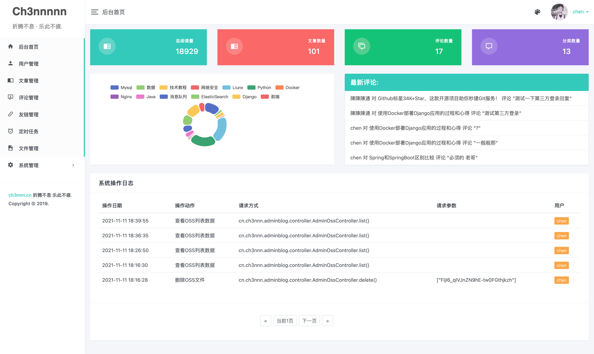
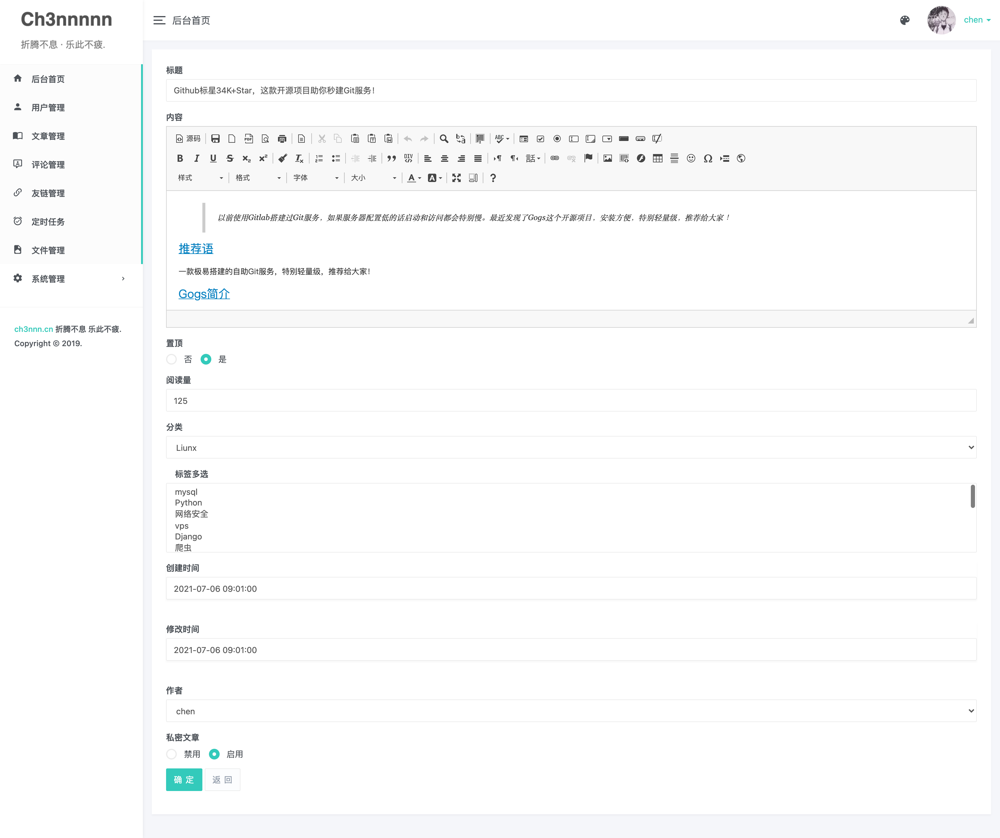
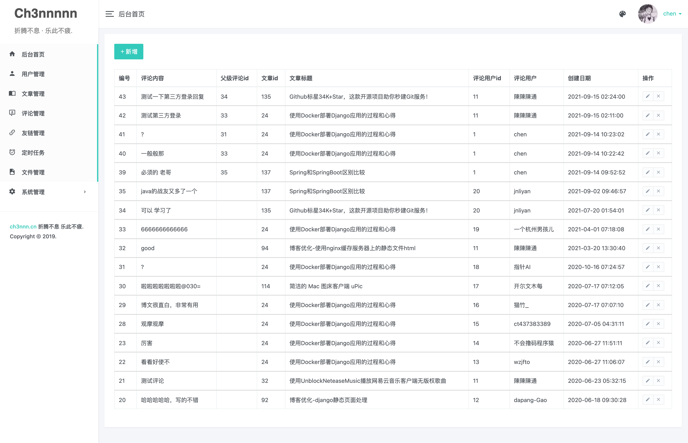
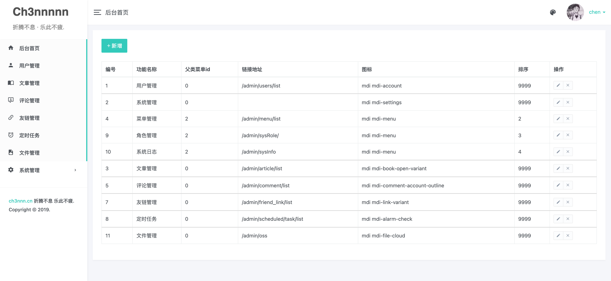
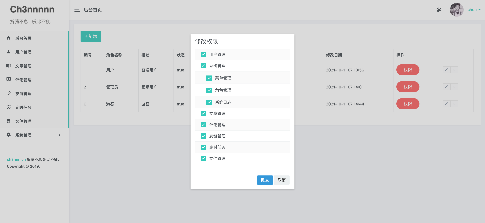
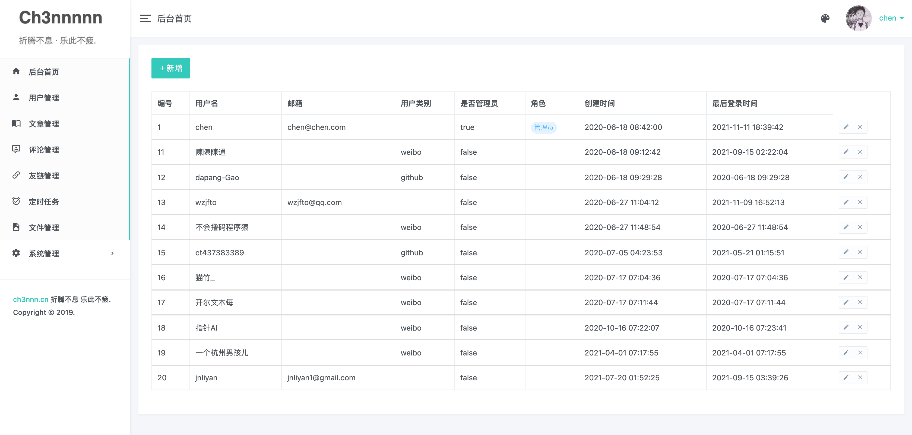
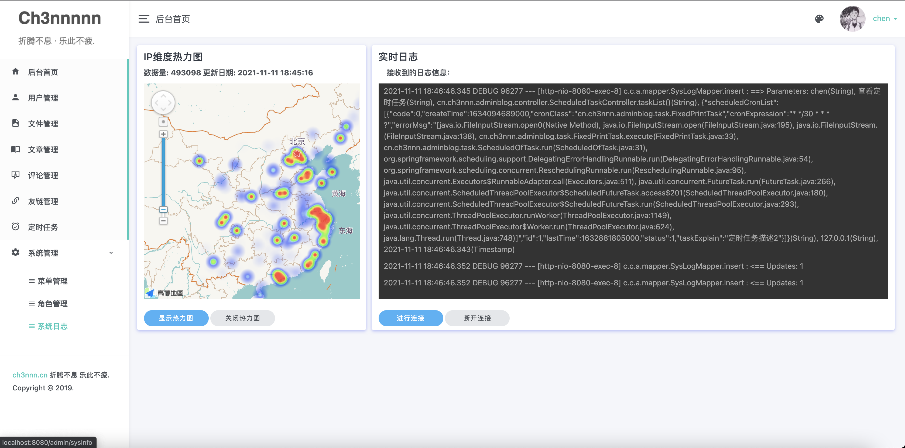

# adminblog

#### 介绍

基于 Spring Boot 搭建 Django 博客后台管理系统

### 技术架构：

#### 开发环境

* 语言：Java 8
* IDE(JAVA)： IDEA
* IDE(前端)：IDEA
* 依赖管理：Maven
* 数据库：MySQL5.7+
* 缓存：Redis
* 搜索引擎: Elasticsearch 7.6.2

#### 前端

* Thymeleaf
* Bootstrap v3.3.7
* jQuery 2.1.4

#### 后端

* 基础框架：Spring Boot 2.3.1.RELEASE

* 持久层框架：Mybatis-plus

* 安全框架：Spring Security

* 缓存框架：redis

* 日志打印：logback

* 搜索引擎: Elasticsearch

* 其他：fastjson, Swagger-ui, lombok 等

#### 效果

**首页**

**文章管理**

**评论管理**

**菜单管理**

**权限管理**

**用户管理**

**系统日志**

